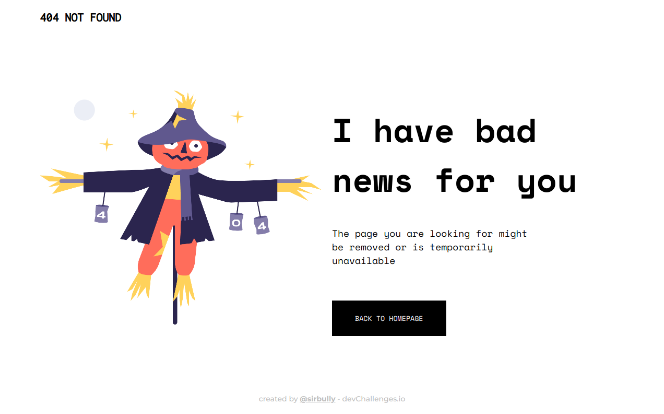

<!-- Please update value in the {}  -->

<h1 align="center">404 Not Found Challenge</h1>

   Solution for a challenge from  <a href="http://devchallenges.io" target="_blank">Devchallenges.io</a>.

  <h3>
    <a href="https://dc-rwd-1.vercel.app/">
      Demo
    </a>
     | 
    <a href="https://devchallenges.io/solutions/Up56RQwf6ICwdDfdvxXC">
      Solution
    </a>
     | 
    <a href="https://devchallenges.io/challenges/wBunSb7FPrIepJZAg0sY">
      Challenge
    </a>
  </h3>

<!-- TABLE OF CONTENTS -->

## Table of Contents

- [Table of Contents](#table-of-contents)
- [Overview](#overview)
  - [Built With](#built-with)
- [Features](#features)
- [Acknowledgements](#acknowledgements)
- [Contact](#contact)

<!-- OVERVIEW -->

## Overview

The project is hosted on Vercel. It took about a couple of hours to complete. I needed to familiarize myself with media queries again. I am so used to frameworks that I forget the fundamental information required for responsive web desgin. Grateful to TailwindCSS for speeding up the process but sometimes it's good to get back to basics.

### Built With

- Vanilla HTML and CSS

## Features

This site was created as a submission to a [DevChallenges](https://devchallenges.io/challenges) challenge. The [challenge](https://devchallenges.io/challenges/wBunSb7FPrIepJZAg0sY) was to build a 404 website.

## Acknowledgements

<!-- This section should list any articles or add-ons/plugins that helps you to complete the project. This is optional but it will help you in the future. For exmpale -->

- [Vercel](https://vercel.com/dashboard)
- [A Complete Guide to Flexbox](https://css-tricks.com/snippets/css/a-guide-to-flexbox/)
- [A Complete Guide to CSS Media Queries](https://css-tricks.com/a-complete-guide-to-css-media-queries/)

## Contact

- Website [sirbully.github.io](https://sirbully.github.io/)
- GitHub [@sirbully](https://{github.com/sirbully})
